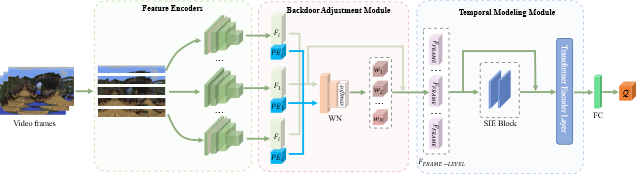
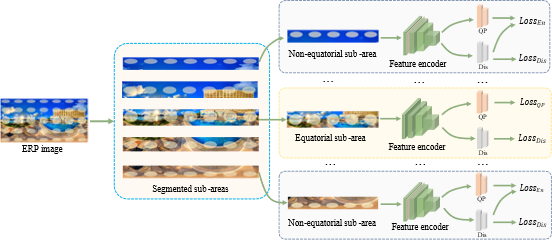

[](https://github.com/Aca4peop/CIQNet/blob/main/LICENSE)

#   Omnidirectional  Video Quality Assessment with Causal Intervention

Source code for paper  Omnidirectional  Video Quality Assessment with Causal Intervention  



# Requirements

- [FFmpeg](http://ffmpeg.org/) version 4.4.3 or higher is required for video decoding.

- The following Python dependencies are recommended:

  ```
  torch==2.0.1+cu118
  torchvision==0.15.2+cu118
  scikit-video
  scikit-image
  tqdm
  numpy
  scipy
  einops
  ```

  

# Datasets

Click the hyper links to see the details of these datasets.

### 360 video datasets:

1. [ODV-VQA](https://github.com/Archer-Tatsu/VQA-ODV)

2. [JVQD](http://data.etrovub.be/qualitydb/judder-vqa/)

3. [SVQD](https://github.com/Telecommunication-Telemedia-Assessment/360_streaming_video_quality_dataset)

   

### 360 Image dataset

1. [IQA-ODI](https://github.com/yanglixiaoshen/SAP-Net)

5-folds cross test was adopted in the experiment. Each dataset was split into non-overlapping five splits, each split has the similar distribution of qualities. See [datasets](./datasets/Readme.md) for more details.

# Usages

## 1. Directly use

​		1. Command line

```bash
python CIQNet.py --video_path test.mp4
```

2. Python

```python
from CIQNet import inference
score=inference('test.mp4')
print(score)
```

The model was trained on the entire ODV-VQD database.

## 2. Pre-train a CNN backbone: Latitude-Invariant Representation Learning



The pre-train is conducted on the [IQA-ODI](https://github.com/yanglixiaoshen/SAP-Net) dataset. We add a 7×7 convolutional layer after the first convolutional layer of the feature encoder to adjust the feature maps (the gray layer) and only update the parameters of the added layers during training to avoid overfitting.

A trained weights file for ResNet18 is provided in weights/pretrained .Run Pre_train.py for pre-training a new CNN.

##  3. Intral-dataset evaluation

### 1. extract frame-level features

Run the CNNfeatures.py

### 2. train and test CIQNet

Run the IntraDatasetsEval.py

## 4. Cross-dataset evaluation

### 1. extract frame-level features

Run the CNNfeatures.py

### 2. train and test CIQNet

Run the CrossSetEval.py

# Contact

zyhu AT bit DOT com

lxliu  AT bit DOT com
