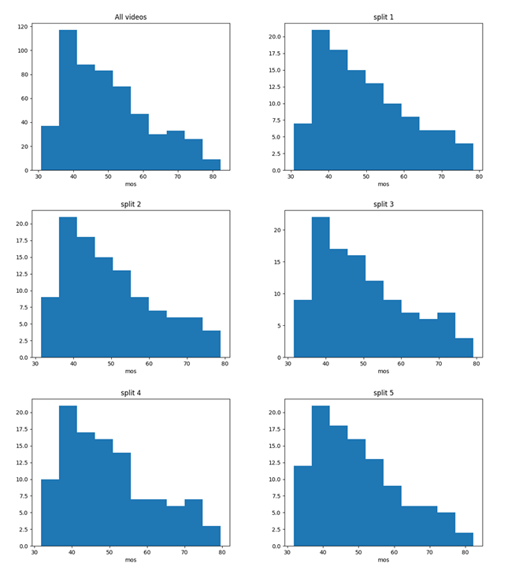
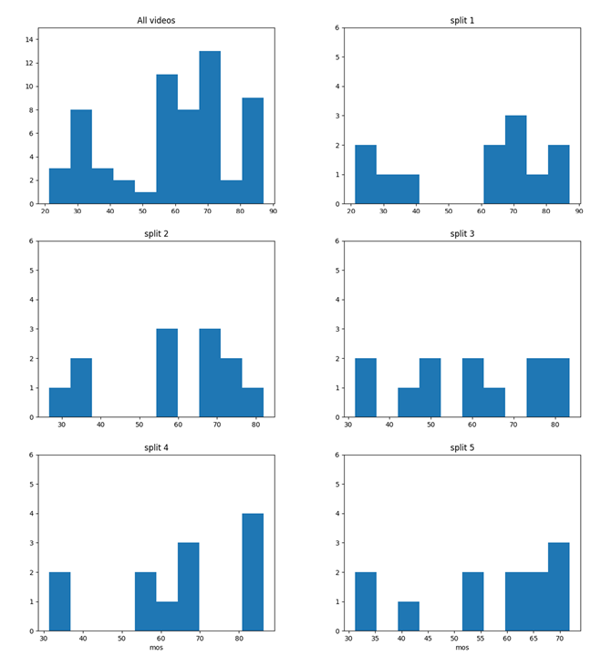
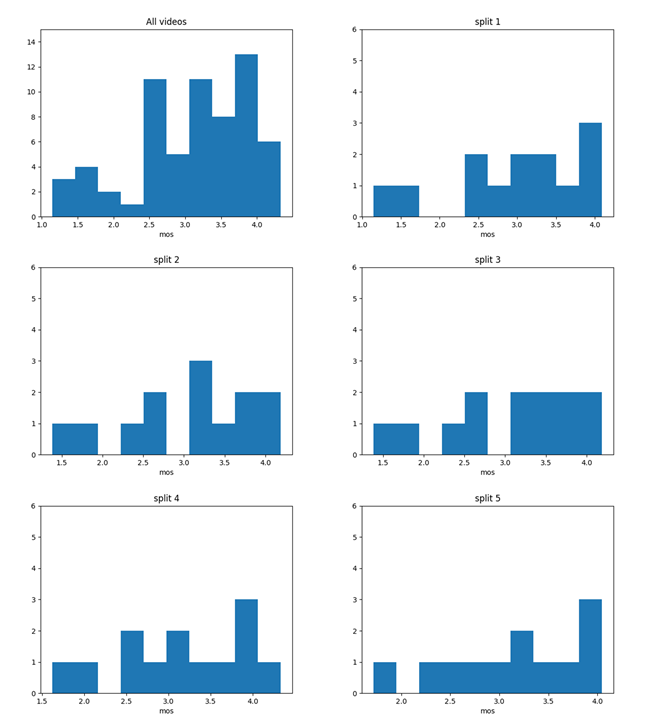

## 1. mat file

The .mat files are the opinion scores of different datasets.

ODI_enhance.mat : IQA-ODI

ODV_dmos_sorted.mat : ODV-VQA

JVQD2.mat : JVQD

360SVQD.mat : 360SVQD

The opinion scores are sorted in ascending order.

## 2. 5-fold split

To guarantee the independently identically distribution (IID) hypothesis, the 5 splits of a dataset have the similar quality distributions. Note the 5 folds are non-overlapping.  The histogram of each split are as following:

### ODV-VQA

### JVQD

### 360SVQD

